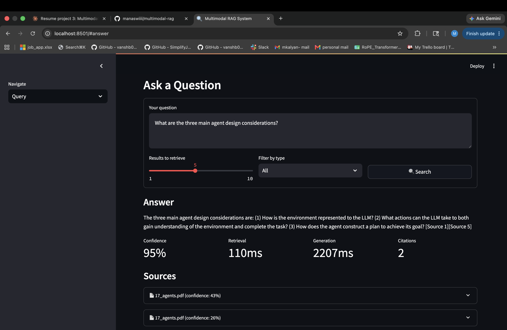
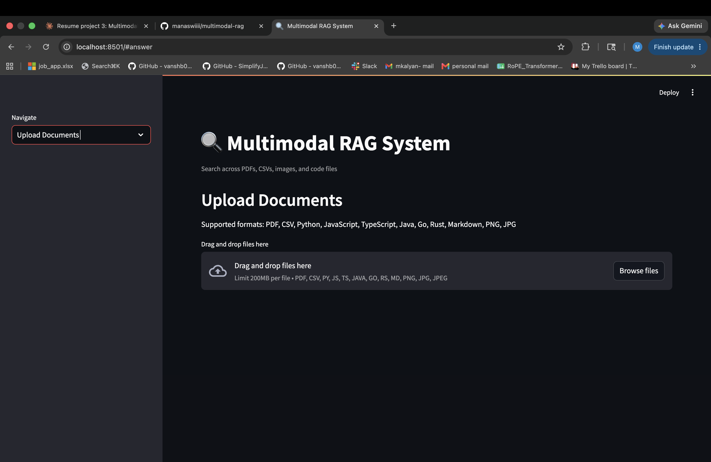
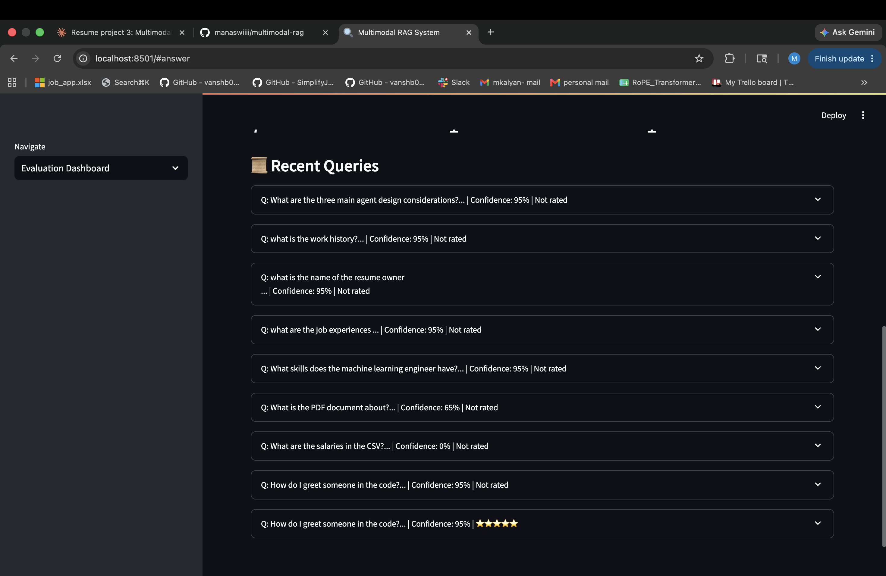
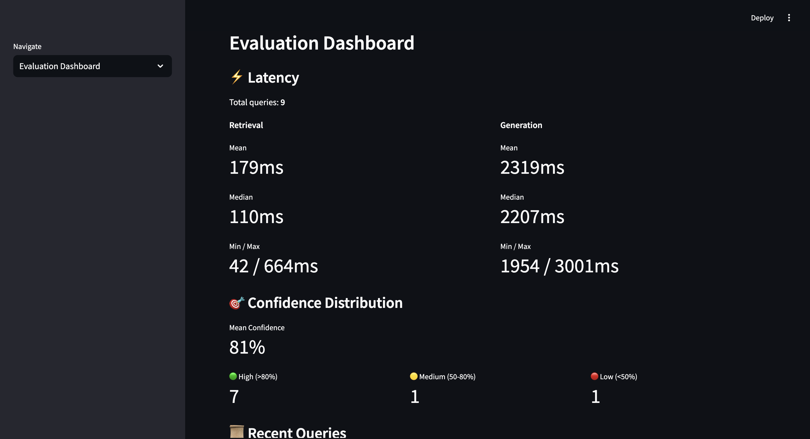

# Multimodal RAG System

A production-grade Retrieval-Augmented Generation system that ingests PDFs, images, CSVs, and code files, embeds them into a vector database, and answers questions with grounded citations.

## Features

- **Multimodal Ingestion** — PDFs, images (OCR), CSVs, and code files
- **Hybrid Search** — combines semantic (FAISS) + keyword (BM25) retrieval
- **Grounded Answers** — Claude generates answers with source citations and confidence scores
- **Evaluation Metrics** — ROUGE scores, retrieval latency, confidence distribution
- **Query History** — tracks all queries with answer ratings
- **Streamlit UI** — upload files, query, and view metrics in a browser

## Tech Stack

| Layer | Technology |
|---|---|
| LLM | Anthropic Claude (claude-haiku) |
| Embeddings | sentence-transformers (all-MiniLM-L6-v2) |
| Vector DB | FAISS |
| Keyword Search | BM25 (rank-bm25) |
| OCR | Tesseract |
| Backend | FastAPI + SQLAlchemy |
| Database | PostgreSQL |
| Frontend | Streamlit |
| Containerization | Docker + Docker Compose |

## Setup

### Local

    git clone https://github.com/manaswiiii/multimodal-rag.git
    cd multimodal-rag
    python3 -m venv venv && source venv/bin/activate
    pip install -r requirements.txt
    cp .env.example .env
    uvicorn app.main:app --reload --port 8000
    streamlit run frontend/app.py

### Docker

    ANTHROPIC_API_KEY=your_key docker-compose up

## API Endpoints

| Method | Endpoint | Description |
|---|---|---|
| POST | /api/v1/ingest | Upload and ingest a file |
| POST | /api/v1/query | Query across all documents |
| GET | /api/v1/documents | List all documents |
| DELETE | /api/v1/documents/{id} | Delete a document |
| GET | /api/v1/history | Query history |
| POST | /api/v1/history/{id}/rate | Rate an answer |
| GET | /api/v1/evaluate | Evaluation metrics |

## Evaluation

- **Retrieval latency:** ~100ms median
- **Generation latency:** ~2.3s median (Claude API)
- **ROUGE-1:** ~0.39 on test queries
- **Confidence:** mean 0.70 across queries

## Project Structure

    multimodal-rag/
    ├── app/
    │   ├── ingestion/    # PDF, CSV, image, code ingesters + embedder
    │   ├── retrieval/    # Hybrid retriever (FAISS + BM25)
    │   ├── generation/   # LLM answer generation with citations
    │   ├── evaluation/   # ROUGE, latency, confidence metrics
    │   └── api/          # FastAPI routes and schemas
    ├── frontend/         # Streamlit UI
    └── data/

## Architecture

    User Query
        ↓
    FastAPI Backend
        ├── Hybrid Retriever (FAISS + BM25)
        │       └── PostgreSQL (chunk metadata)
        └── Claude API (answer generation)
                └── Grounded answer + citations

## Screenshots

